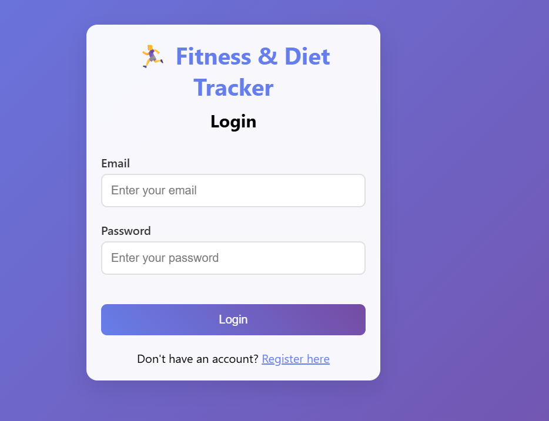
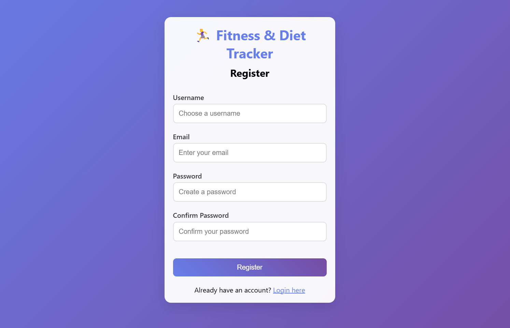
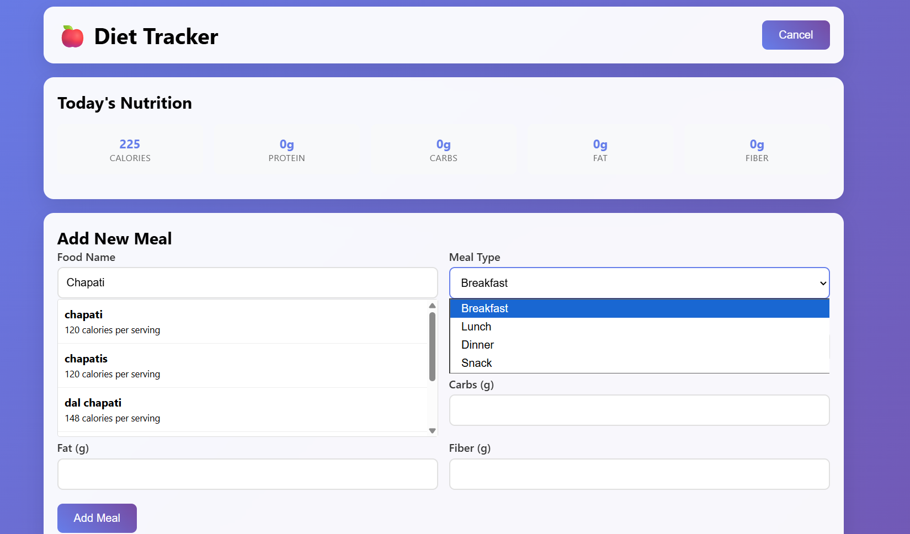
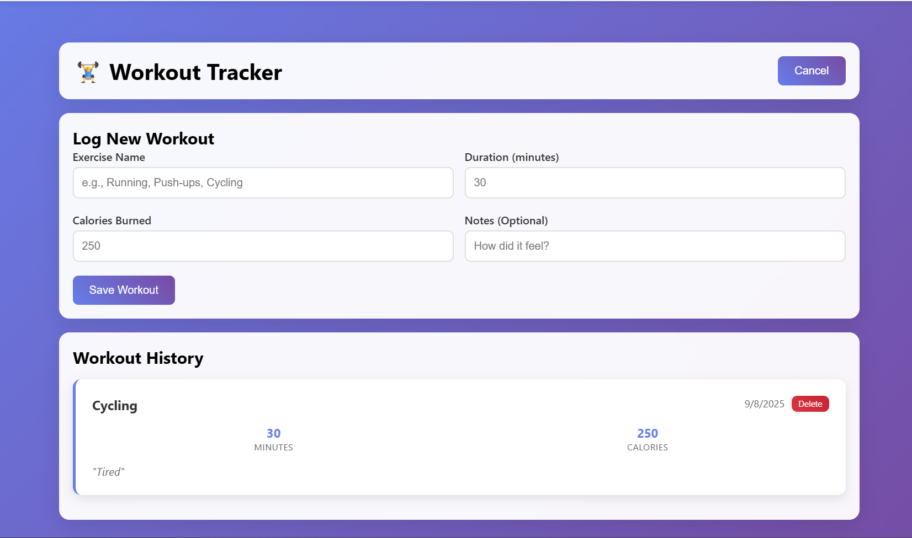
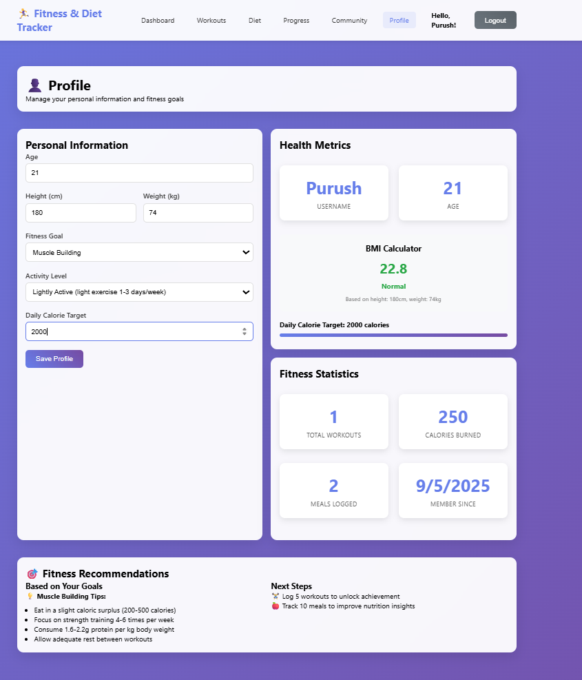
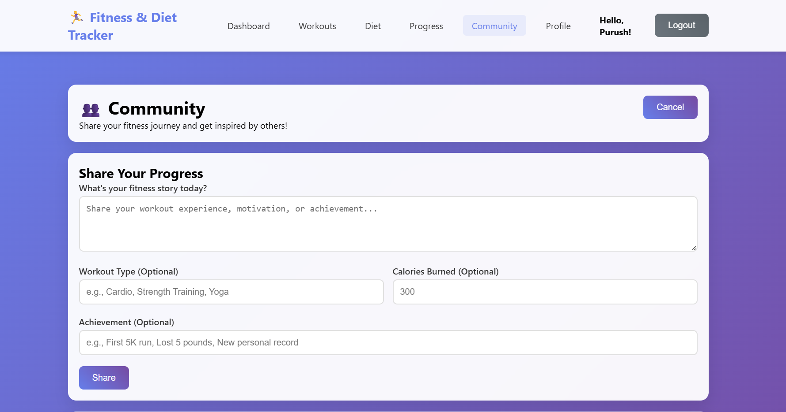

# 🏋️‍♂️ Fitness & Diet Tracker

> A powerful **full-stack fitness and diet tracking app** with an elegant React frontend and scalable Node.js backend. Track workouts, analyze nutrition with real data, visualize progress, share achievements with the community, and receive automated weekly reports.

---

## ✨ Key Highlights

- 🔐 Secure registration & session-based authentication
- 🏋️‍♀️ Workout tracking with detailed metrics (sets, reps, weights)
- 🥗 Nutrition analysis by real-time Nutritionix API calls
- 📊 Interactive progress charts using Recharts
- 👥 Community features for sharing, liking posts & supporting each other
- 📧 Automated weekly fitness email reports via Node-cron + Nodemailer
- 📱 Fully responsive, mobile-friendly design
- 🚀 Ready for cloud deployment (Replit autoscale)

---

## 📁 Project Structure

fitness-diet-app/
├── server.js # Backend entry (Express.js)
├── package.json # Backend dependencies
├── client/ # React frontend source
│ ├── package.json # Frontend dependencies
│ ├── public/
│ ├── src/
│ │ ├── components/ # React components (Auth, Dashboard, etc.)
│ │ ├── context/ # Auth context provider
│ │ └── styles/ # CSS stylesheets
│ └── screenshots/ # App UI images
│ ├── Addmeal.png
│ ├── Community.png
│ ├── Login.png
│ ├── profile.png
│ ├── Register.png
│ └── workout.png
└── fitness_diet.db # SQLite database file

text

---

## 🖼️ Visual Walkthrough

| Login                                       | Register                                    |
|---------------------------------------------|--------------------------------------------|
|       |  |

| Add Meal                                   | Workout Tracker                            |
|---------------------------------------------|--------------------------------------------|
|   |  |

| Profile                                    | Community                                  |
|---------------------------------------------|--------------------------------------------|
|   |  |

---

## 🔧 Technology Stack

| Layer       | Technology Used                    |
|-------------|----------------------------------|
| Frontend    | React.js, Context API, Recharts  |
| Backend     | Node.js, Express.js               |
| Database    | SQLite (better-sqlite3)           |
| APIs        | Nutritionix API                  |
| Email       | Nodemailer, Node-cron             |
| Authentication | Session-based with bcrypt       |
| Deployment  | Replit autoscale-compatible       |

---

## 🚀 Features

- Register, login, logout securely with session management
- Log and manage detailed workouts (exercises, sets, reps, weight)
- Track meals with Nutritionix-powered nutrition data lookup
- Visualize progress with interactive charts for calories, weight, and workouts
- Share posts and achievements with the community and interact by liking posts
- Receive automated weekly summaries and fitness progress emails
- Fully responsive UI works on mobile, tablet, and desktop

---

## 🛠️ Setup Guide

### Prerequisites

- Node.js (v14 or newer)
- npm or yarn
- Nutritionix API credentials (App ID & API Key)
- Email account for sending reports (Gmail with app password recommended)

### Installation Steps

Clone the repository
git clone https://github.com/your-username/fitness-diet-app.git
cd fitness-diet-app

Install backend dependencies
npm install

Install frontend dependencies
cd client
npm install

text

### Environment Variables

Create a `.env` file in the project root with the following:

NUTRITIONIX_APP_ID=your_nutritionix_app_id
NUTRITIONIX_API_KEY=your_nutritionix_api_key
EMAIL_USER=your_email@example.com
EMAIL_PASS=your_email_app_password

text

### Running The Project

Start backend server
npm run server

Start frontend dev server (in a separate terminal)
cd client && npm start

Or run both concurrently
npm run dev

text

Open your browser at [http://localhost:5000](http://localhost:5000) to use the app.

---

## 📡 API Endpoints Overview

### Authentication

| Method | Endpoint          | Description            |
|--------|-------------------|------------------------|
| POST   | `/api/register`   | User registration       |
| POST   | `/api/login`      | User login              |
| GET    | `/api/user`       | Get current logged-in user |
| POST   | `/api/logout`     | User logout             |

### Workouts

| Method | Endpoint             | Description         |
|--------|----------------------|---------------------|
| GET    | `/api/workouts`      | Get all user workouts |
| POST   | `/api/workouts`      | Add a new workout    |
| PUT    | `/api/workouts/:id`  | Update workout by ID |
| DELETE | `/api/workouts/:id`  | Delete workout by ID |

### Meals & Nutrition

| Method | Endpoint                | Description         |
|--------|-------------------------|---------------------|
| GET    | `/api/meals`            | Get all user meals  |
| POST   | `/api/meals`            | Add a new meal      |
| POST   | `/api/nutrition/search` | Search nutrition (Nutritionix) |
| DELETE | `/api/meals/:id`        | Delete meal by ID   |

### Progress & Community

| Method | Endpoint                       | Description          |
|--------|--------------------------------|----------------------|
| GET    | `/api/progress`                | Get progress entries  |
| POST   | `/api/progress`                | Add progress entry    |
| GET    | `/api/community/posts`         | Get community posts   |
| POST   | `/api/community/posts`         | Create a community post |
| POST   | `/api/community/posts/:id/like` | Like/unlike a post    |

---

## 🆕 Recent Updates

- Completed React migration frontend
- Full RESTful backend APIs
- Extended SQLite schema for meals, progress, and community posts
- Nutritionix API integration for real nutrition data
- Weekly fitness reports with Node-cron and Nodemailer
- Interactive Recharts progress charts
- Social sharing & community engagement features
- Configured for Replit autoscale deployment

---

## 🤝 Contributing

Contributions always welcome!  
Submit pull requests for new features, bug fixes, or docs improvements. Open issues to report bugs or request features.

---

## 📫 Contact

For questions or feedback, please open a GitHub issue or reach out by email to **EMAIL_USER**.

---

  <em>Keep progressing and stay motivated — your journey to fitness starts here!</em>

